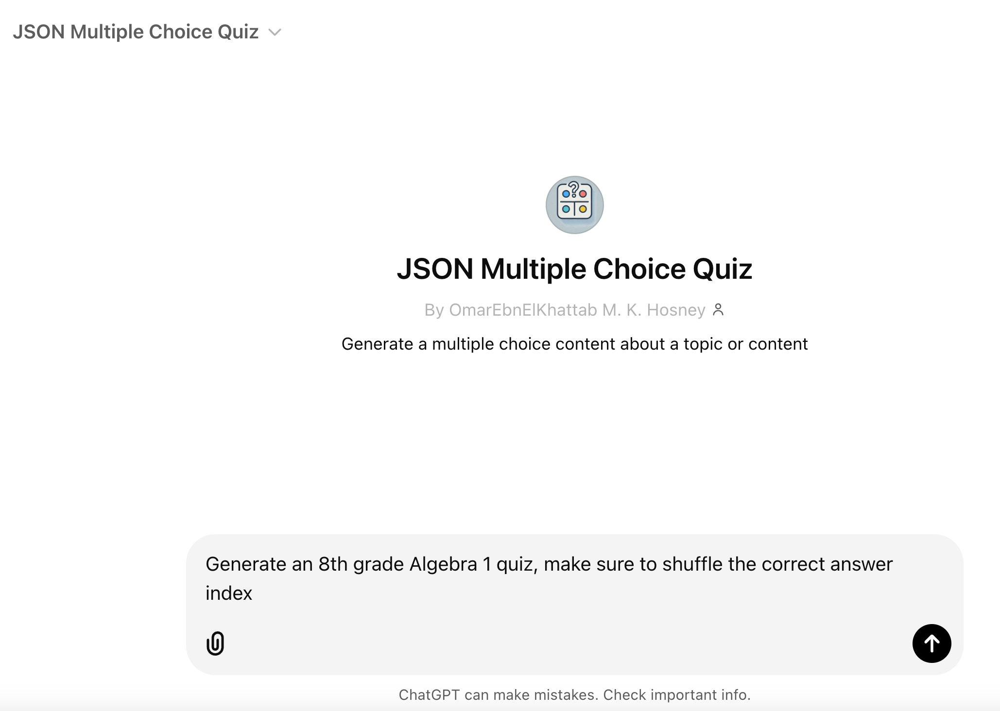
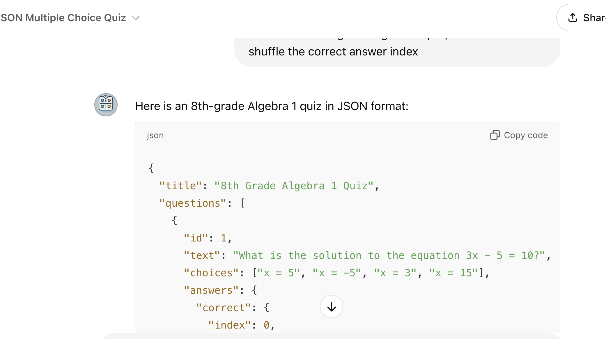

# Flexible Quiz

Flexible Quiz is a Vue.js application designed to generate interactive HTML quizzes from JSON files. This application allows users to upload a JSON file containing quiz questions and answers, which are then rendered into a user-friendly quiz interface.

## Sample Quiz


## Quiz Modes

The application offers two distinct quiz modes:

### Standard Quiz (quiz.html)
- Automatic progression after answering each question
- Brief feedback showing correct/incorrect status
- 2-second delay before moving to next question
- Ideal for quick assessments and timed tests

### Practice Quiz (practice.html)
- Manual progression with "Next Question" button
- Detailed feedback with explanations for each answer
- Students control their own pace
- Better for learning and understanding concepts

## Features

- **Dynamic Quiz Generation**: Load quizzes dynamically from JSON files.
- **Interactive UI**: Provides an engaging user interface with real-time feedback on answers.
- **Performance Tracking**: Displays scores and time spent on each question.
- **Review Incorrect Answers**: Offers explanations for incorrect answers to enhance learning.
- **Flexible Learning Modes**: Choose between timed quizzes or self-paced practice sessions.

## Getting Started

### Prerequisites

- Ensure you have a modern web browser installed.
- No additional software is required to run the application.

### Usage

1. **Upload a Quiz**: Click on "Choose Quiz File" to upload a JSON file containing your quiz.
2. **Start the Quiz**: Once the quiz is loaded, click "Start Quiz" to begin.
3. **Answer Questions**: Select your answer for each question and receive immediate feedback.
4. **View Results**: After completing the quiz, view your score and review any incorrect answers.

### JSON File Format

The JSON file should follow this structure:

```json
{
    "title": "Quiz Title",
    "questions": [
        {
            "id": 1,
            "text": "Question text",
            "choices": ["Choice 1", "Choice 2", "Choice 3", "Choice 4"],
            "answers": {
                "correct": {"index": 0, "comment": "Explanation for correct answer"},
                "wrong": [
                    {"index": 1, "comment": "Explanation for wrong answer"},
                    {"index": 2, "comment": "Explanation for wrong answer"},
                    {"index": 3, "comment": "Explanation for wrong answer"}
                ]
            }
        }
    ]
}
```

## Example of Final Report


## Using the Custom Chatbot

You can generate JSON quiz files using a Custom ChatGPT Bot. This bot helps create multiple-choice quizzes in the required JSON format.

### How to Use

1. **Access the Bot**: Visit the [ChatGPT Custom GPT](https://chatgpt.com/g/g-5ZAIVfT89-json-multiple-choice-quiz).
2. **Generate a Quiz**: Enter your request, such as "Generate an 8th grade Algebra 1 quiz, make sure to shuffle the correct answer index."

   

3. **Receive the JSON**: The bot will provide a JSON formatted quiz.

   

This project is licensed under the Apache License, Version 2.0 - see the [LICENSE](LICENSE) file for details.

## Acknowledgments

- Built with [Vue.js](https://vuejs.org/)
- Math rendering powered by [MathJax](https://www.mathjax.org/)
- Charting provided by [Chart.js](https://www.chartjs.org/)
